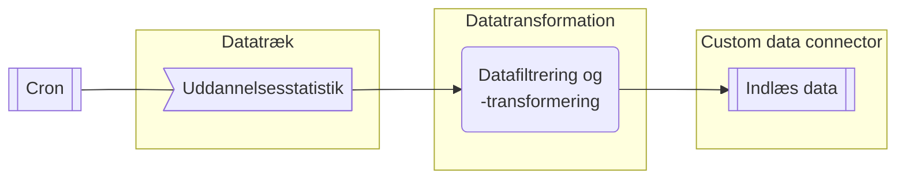

# Auto-forward-uddannelsesstatistik
|  [**Beskrivelse**](#beskrivelse)  |  [**Afhængigheder**](#afh%C3%A6ngigheder)  |  [**Ressourcer**](#Ressourcer)   |

### Beskrivelse

Automatiseringsløsningen er opbygget som løst koblet arkitektur hvor data styres igennem en række komponenter der er simple at vedligeholde og udskifte. 

- **Kører hvert kvartal** 
	- Beregner dataperioder siden start tidspunkt
- **Der skabes ét, eller flere API-kald til Uddannelsesstatistik**
	- Der skabes ét API-kald for hver dataperiode
- **Data hentes** (såfremt data eksisterer)
- **Data transformeres efter datatrækkets opsætning**
	- Data filtreres og kolonner omdøbes
- **Ny data afleveres til custom data connector** 

### Afhængigheder
* [custom-data-connector](https://github.com/Randers-Kommune-Digitalisering/custom-data-connector)
* [uddannelsesstatistik.dk](https://uddannelsesstatistik.dk)

### Ressourcer
Kommer snart ...
