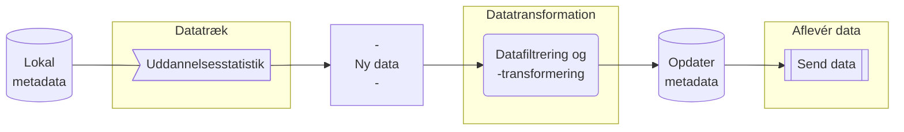

# Auto-forward-uddannelsesstatistik
|  [**Beskrivelse**](#beskrivelse)  |  [**Afhængigheder**](#afh%C3%A6ngigheder)  |  [**Ressourcer**](#Ressourcer)   |

### Beskrivelse

Automatiseringsløsningen er opbygget som løst koblet arkitektur hvor data styres igennem en række komponenter der er simple at vedligeholde og udskifte. 

- **Først kontrolleres lokal metadata op mod aktuel dato** 
	- Her kontrolleres det om seneste succesfulde datatræk var i indeværende eller sidste dataperiode
- **Der skabes ét, eller flere API-kald til Uddannelsesstatistik**
	- Der skabes ét API-kald for hver manglende dataperiode
- **Ny data hentes** (såfremt data eksisterer)
- **Data transformeres efter datatrækkets opsætning**
	- Data filtreres og kolonner omdøbes
- **Lokal metadata opdateres**
	- Metadataene indeholder info vedr. seneste datatræk (periode, antal rækker i datasæt, timestamps)
- **Ny data afleveres til kontaktperson** 

### Afhængigheder
Kommer snart ...

### Ressourcer
Kommer snart ...
